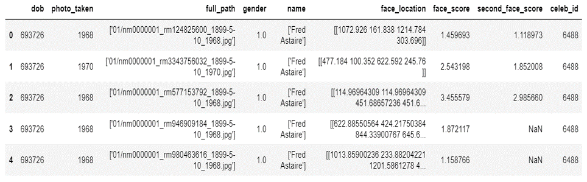
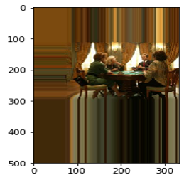
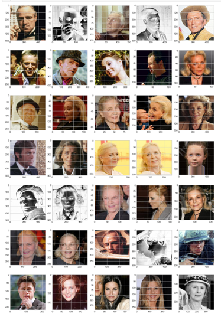
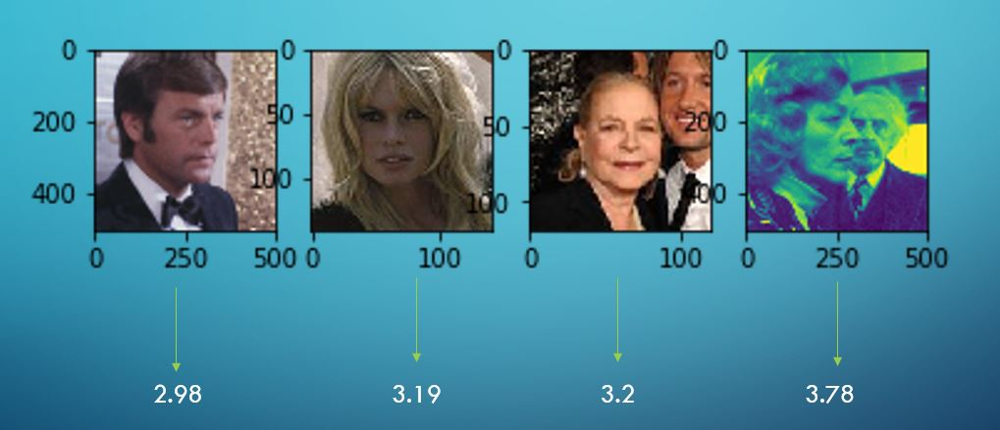
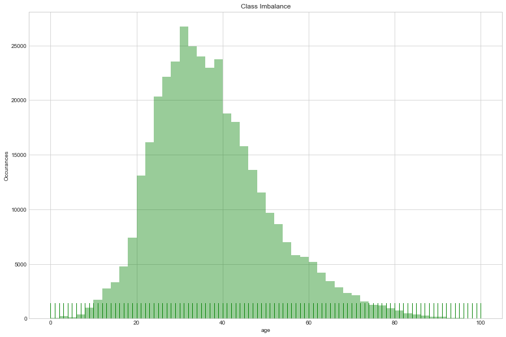
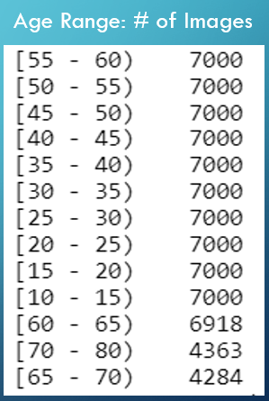
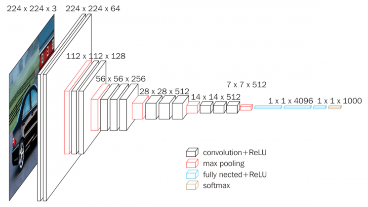

# Classifying Age Range From Face

The goal of this project is to be able to classify age ranges by using a convolutional neural network that is trained on face images.

## Data
The data used was from the IMDB-Wiki dataset which was created by Rasmus Rothe, Radu Timofte, and Luc Van Gool at the Computer Vision Lab at ETH Zurich. The original data set contains 524,230 images that were scraped from IMDB and Wikipedia websites. These images can be downloaded from https://data.vision.ee.ethz.ch/cvl/rrothe/imdb-wiki/.

For this project, 85,213 images were used to reduce the computational load of the project due to time constraints. The images have metadata which describe when the image was taken as well as information about the actor in the photo such as the actor's DOB, a full path, face score, and a second face score. The image below shows some examples of the meta data. 

### Exporatory Data Analysis 

The biggest question upon first seeing the data is understanding the DOB which is in MATLAB datetime format. This needed to be converted back to a normal date time format. This process can be seen in the notebook titled "Data Cleaning + EDA". The following steps were done in order to better understand the meta data, specifically face score and second face score. When looking at the face score data, there were about 78,000 images that contained a face score of -inf. Some examples of images with -inf scores can be seen below:

 

It is evident from these images, that images with face scores of -inf should be removed since no face image can even be discerned from these pictures. The other face score were in a range between a little less than 1 and 8. To get a better understanding of how the images change as the face scores change, images with different face scores were looked at. So in the table of images below, the first row contains images with face scores between 0 and 1, the second row contains scores between 1 and 2, so on and so forth. 

From this table, it can be seen that as the face score improves, the faces become more centered, the face is more distinct from its background and the people in the pictures are looking straight forward. 

After this, second face score was examined using a similar approach. The picture below summarizes the relationship that was observed. 

It was seen that once second facescores crosses a certain threshold, there is a second face in the picture. This score happenned to be around 3.1. So images that had a second face score greater than 3.1 were removed. So after removing these pictures, as well as pictures that had ages that didn't make sense, there were about 381,000 pictures. The following graph shows the distribution of the labeled ages of the pictures. 

From the distribution above, it can be seen that there aren't enough images of people younger than 10, and older than 80. These images were removed, afterwhich the pictures were put into bins of age ranges. In order to balance the classes, many ranges had to be downsampled. 

#### CNN Model 

There are now 85,565 images left to use for training, validating, and testing the convolutional neural network. Of these pictures, 59,110 images were used for training, 6567 images were used for testing, and 16860 images were used for testing. There was a total of 13 classes. The breakdown of these classes and the number of images in each class can be seen below. 

For the CNN, transfer learning was used by using VGG-16's convolutional base. VGG-16 is a famous CNN that was trained on ImageNet which is a dataset of over 14 million images belonging to 1000 classes. The model itself achieved 92.5% accuracy on these images. It originally classified images into 1000 different classes, but in this case the top layers were changes so that it can classify face images into the 13 classes or age groups. The full VGG-16 architecture can be seen below. 

The new model will not use the fully connected layers and softmax layers shown in the pictures. Instead it has different fully connected layers and softmax layers that will classify images into 13 age groups. Only these layers are also trained while the previous layers are untrained and are using the weights from when VGG-16 was trained on Image-Net. 

